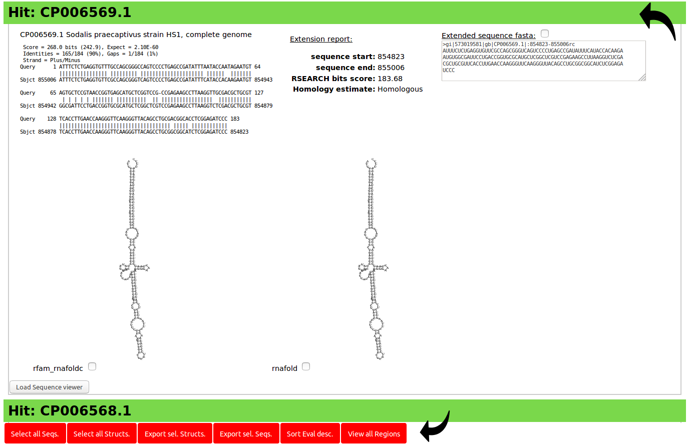
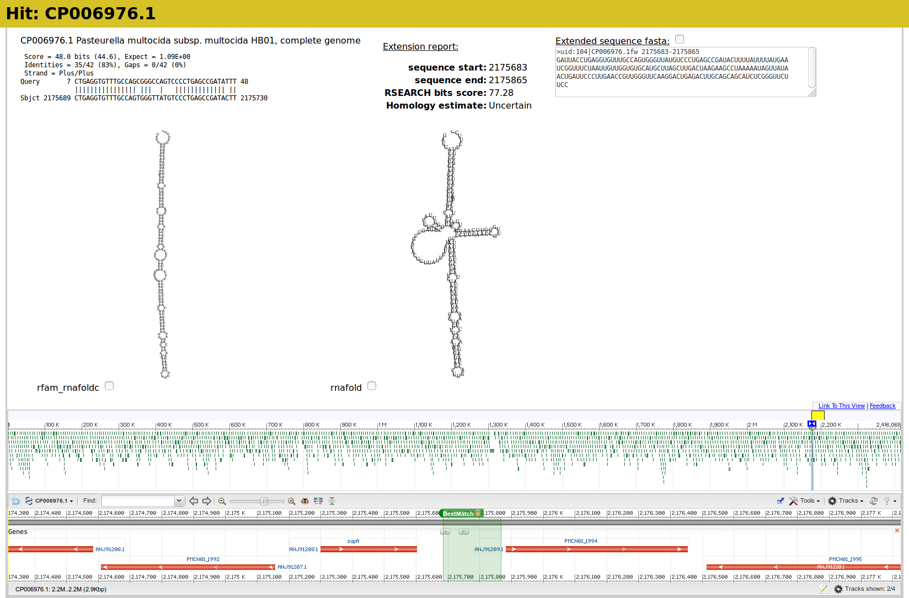

# rboAnalyzer
## Introduction
rboAnalyzer is pipeline meant as a complementary step when BLAST algorithm
 was used to search for query that is non-coding RNA (ncRNA) with secondary structure (does not have to be known).
As the BLAST is general sequence alignment algorithm, it's results (output)
 is missing some very useful features in context of ncRNAs.

Also the output apart from well scoring hits, usually contains sequence
 fragments (subject sequence only partially aligned to query).
Such hit may bring valuable information by capturing distant homology or
it may be nothing.

With our rboAnalyzer we add information to such BLAST search to help researcher
 decide which hits are real ncRNAs and what their secondary structure might be.

## Functionality overview


The rboAnalyzer has 3 stages:
1) Estimation of full-length RNA sequence from HSP (extension).
2) Estimation of homology of estimated full-length sequences to query sequence.
3) Prediction of secondary structures.

Each of these stages has dedicated section.

### Methods for estimation of full-length sequences from HSPs
The pipeline has 3 methods for estimating the full-length sequences from BLAST HSPs.

1) __simple__

    This means that location of estimated full-length sequence is computed from
     unaligned parts of query sequence on 5' and 3' ends of the HSP.

2) __locarna__

    In this method, the loci containing hit with flanking regions at the subject sequence is realigned to
     the query sequence with Locarna algorithm. The sequence
     aligned to the query is considered to be the estimated full-length sequence.

3) __joined__

    Here the two aforementioned methods are combined and estimated full-length sequences
     are scored with covariance model. The better scoring sequence is chosen.

#### ad simple)


In this mode we compute the location of estimated full-length sequence by taking length of
 unaligned parts of query sequence in HSP (can be at start, end or both) and add or
 subtract it respectively from hit start/end index.
In the toy example we have the Plus/Plus BLAST HSP with query sequence
 aligned from 10 to 21 to subject sequence 1000 to 1009.
If query is 50 bases long, then length of unaligned query at start is 9
 and length of unaligned query at end is 29.
Then start of the estimated full-length sequence in subject is 1000 - 9 = 991 and end is
 1009 + 29 = 1038.


#### ad locarna)


With __locarna__ mode we first extract so called _supersequence_, which is
 region on subject sequence as with __simple__,
 additionally padded on 5' and 3' ends by extra sequence from the subject sequence.
This _supersequence_ is then realigned with Locarna algorithm to obtain the estimated full-length sequence.

The Locarna algorithm utilises possible pairings in it's computations,
 thus it is better suited to align RNAs then BLAST algorithm.
The Locarna is by default called with `struct-local=0`,
 `sequ-local=0` and `free-endgaps=++++` parameters.
Additionally the information about matching nucleotides from BLAST HSPs
is used to construct so called anchor for the Locarna algorithm.
The anchor defines columns of alignment which are considered aligned.
As the anchor we consider consecutive series of matches of length at
 least `L` in BLAST alignment.
The default value of `L` is 7.
This way the alignment is anchored and the Locarna algorithm can align
 query to the _supersequence_. With the `free-endgaps=++++` option,
 the algorithm does not put penalty to unaligned ends of _supersequence_.
The estimated full-length sequence is the continuous part of _supersequence_ aligned to the query sequence
 (i.e. the subject sequence between the bases, inclusive, on subject sequence matching to the 5' terminal and 3' terminal bases).

#### add joined)
This approach combines the __simple__ and __locarna__. It computes both and 
 for each HSPs it chooses the estimated full-length sequence with higher score to covariance model.

### Estimation of homology
Here we compute score for relation between the estimated full-length sequence and query sequence.
The computation is based on aligning covariance model (CM) to each estimated full-length
 sequence with `cmalign` program from the Infernal package.

We've implemented 3 options on how to provide covariance model:

1) build with RSEARCH (default)

    By default we build the covariance model from the query sequence (secondary structure predicted by RNAfold) and RIBOSUM matrix.
    The RIBOSUM is RIBOSUM65 by default and it can be changed in [alternative](config_how_to.md) `config.txt` file.

2) supply your own model (the `--cm_file` option)

    If the covariance model is known, it can be provided with `--cm_file` option.
    Only one model per file is allowed.
    
    Note that if you provide the covariance model, it will also be used in all methods for prediction of secondary structures using covariance models (those starting with `rfam`).

3) infer from Rfam (the `--use_rfam` option)

    The Rfam database is searched with query sequence for the best matching
    model (`cmscan`).

### Prediction of secondary structures
The rboAnalyzer can use multiple approaches (prediction methods) to predict secondary structures.
The prediction methods can be (roughly) divided to following groups:

- Predict structure independently of other estimated full-length sequences
    The advantage for these methods is robustness to possible improper parameter choice.
    - [rnafold](prediction_methods.md#rnafold)
    - [fq-sub](prediction_methods.md#fq-sub)
    - [rfam-Rc](prediction_methods.md#rfam-Rc)
    - [rfam-centroid](prediction_methods.md#rfam-centroid)
    - [rfam-sub](prediction_methods.md#rfam-sub)

- Use of selected estimated full-length sequences as reference
    - [centroid](prediction_methods.md#centroid)
    - [TurboFold](prediction_methods.md#TurboFold)
    - [Turbo-fast](prediction_methods.md#Turbo-fast)

- Use of selected estimated full-length sequences to build consensus secondary structure
    - [C-A-r-Rc](prediction_methods.md#C-A-r-Rc)
    - [M-A-r-Rc](prediction_methods.md#M-A-r-Rc)
    - [C-A-U-r-Rc](prediction_methods.md#C-A-U-r-Rc)
    - [M-A-U-r-Rc](prediction_methods.md#M-A-U-r-Rc)
    - [C-A-sub](prediction_methods.md#C-A-sub)
    - [M-A-sub](prediction_methods.md#M-A-sub)

## Output

### Output formats
The rboAnalyzer is able to produce several output formats, most handy being
  being the `.html`.
- html
    Stand-alone web page containing estimated full-length sequences and predicted secondary structures.
    If internet connection is available, it can be used to view respective
    genome loci for each BLAST HSP using NCBI SeqViewer.
- json
    Json-readable rboAnalyzer output (contains all data).
- csv
    Output table in comma separated values. Contains all important information
    including original HSP data, estimated full-length sequence location,
    sequence and predicted secondary structure(s).

## HTML output
In the head section there is report on basic input data and name of Rfam
 covariance model with best score to the provided query sequence.

The html output is organized around BLAST output.
Each BLAST HSP gets it's separate section with five parts:

  1) the text representation of BLAST HSP

  2) rboAnalyzer report with estimated full-length sequence indices and RSEARCH bit score

  3) the estimated full-length sequence itself

  4) one or multiple predicted secondary structures

  5) NCBI Sequence viewer (optional - by default only load button is shown)

The `html` outputs offers sorting, selecting sequences and structures and
  their export to fasta format or fasta-like format with predicted secondary structures in dot-bracket notation.
If internet connection is available, the NCBI genome browser can be used
  to explore synteny and known features of current genome.

The header for each BLAST HSP contains Accession.Version number (based on provided regular expression).
The header is also color-coded on color scale from green to red based on RSEARCH score.
This allows rapid identification of interesting or suspicious HSPs differing from others.

### Example output ideal case


The black arrows points to the HSP header (color indicating homology) and control buttons respectively.

### Example output with  loaded NCBI sequence viewer


### Notes
#### Control buttons
At the bottom of the view there are general control buttons which allow
  selecting and deselecting of sequences and structures, sorting by E-value
  and bulk initialization of NCBI Sequence Viewer.
- Select/Unselect all Seqs. (will select/unselect (check checkbox) all estimated full-length sequences)
- Select/Unselect all Structs (will select/unselect (check checkbox) all predicted structures)
- Export sel. Structs (will trigger download of selected predicted secondary structures in fasta-like format)
- Export sel. Seqs (will trigger download of selected estimated full-length sequences in fasta-like format)
- Sort Eval desc/asc (will sort BLAST HSPs according to E-value Ascending or Descending)
- View all Regions (will trigger loading of NCBI viewer for all (not yet loaded) HSPs)

#### Report structure

1) Inputs: query input file and BLAST input file
  Best matching mode from Rfam

2) Estimated full-length sequences, predicted secondary structures and other data

3) Command and parameters
  - executed commandline string
  - date and time of run
  - parameters

#### The fasta-like format containing secondary structures
```
>uid:N|ACCESSION.VERSIONdirection-method_name START-END (genome location)
SEQUENCE
SECONDARY_STRUCTURE

# - where the N is serial number of BLAST HSP
# - direcion can be "fw" for plus strand and "rc" for minus strand
# - genome-location is then location of found sequence on original genome
#   in START-END format where START is always lower index then END (direction is defined by "direction")
# the sequence is always 5' to 3' direction

>uid:104|CP006976.1fw-rfam-Rc 2175683-2175865
GAUUACCUGAGGUGUUUGCCAGUGGGUUAUGUCCCUGAGCCGAUACUUUUAUUUUAUGAAUCGGUUUCUAAUUGUUGGUGUGCAUGCUUAGCUUGACUAAGAAGCCUAAAAAUAGUUAUAACUGAUUCCCUUGAACCGUUGGGUUCAAGGACUGAGACUUGCAGCAGCAUCUCGGGUUCUUCC
....(((((((((((.(((..(((((((..((((.((((((.(....((((......(((((((((..((((((((..((.((.(.(((((.....)))))).)).))..)))))))).)))))))))...))))....).)))))).))))...))))))).))))))))))))))......
>uid:104|CP006976.1fw-rnafold 2175683-2175865
GAUUACCUGAGGUGUUUGCCAGUGGGUUAUGUCCCUGAGCCGAUACUUUUAUUUUAUGAAUCGGUUUCUAAUUGUUGGUGUGCAUGCUUAGCUUGACUAAGAAGCCUAAAAAUAGUUAUAACUGAUUCCCUUGAACCGUUGGGUUCAAGGACUGAGACUUGCAGCAGCAUCUCGGGUUCUUCC
....(((((((((((((((.((((((......)))......................(((((((((..((((((((..((.((.(.(((((.....)))))).)).))..)))))))).)))))))))(((((((((....)))))))))......))).)))..))))))))))))......
```
#### The NCBI sequence Viewer
The NCBI sequence viewer works only if internet connection is available.
It may take some time to load (especially with large genomes) and when the report
 contains many BLAST hits it may required more substantial amount of RAM.
The data for the sequence viewer are not saved across browser sessions.

## Funding

This work was supported by ELIXIR CZ research infrastructure project (MEYS Grant No: LM2015047) including access to computing and storage facilities.


This work was supported from European Regional Development Fund - Project "ELIXIR-CZ: Budování kapacit" (No. CZ.02.1.01/0.0/0.0/16_013/0001777).

